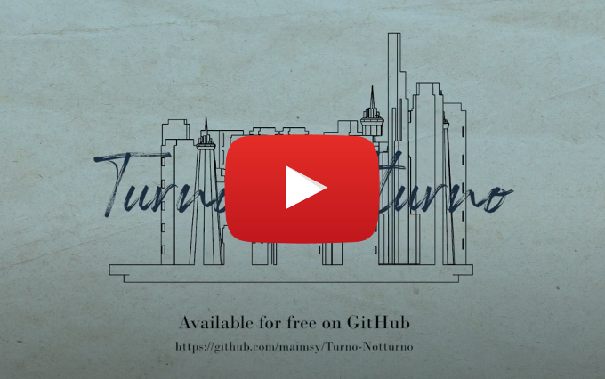

# Turno-Notturno

A student-made Unity game project.

You are a guard in a museum of modern art. Your sleep is interrupted by the loud sound of an alarm siren during your
night shift.
Work through abstract 2d minigames and a fascinating 3d environment to find out what is going on.

## Play the game

A playable beta version can be downloaded from the [releases page](https://github.com/maimsy/Turno-Notturno/releases/tag/v0.9).

## Trailer

Trailer is [available on youtube](http://www.youtube.com/watch?v=B_s0ZY_PEt8).

